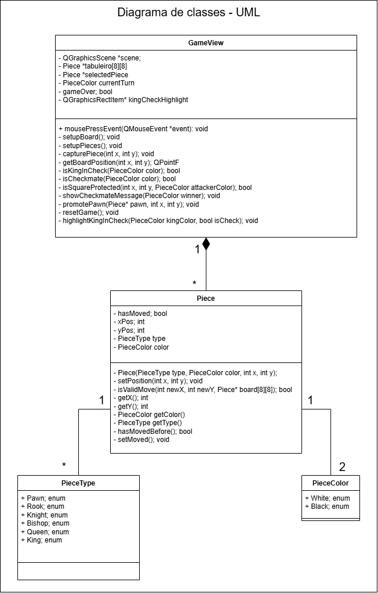
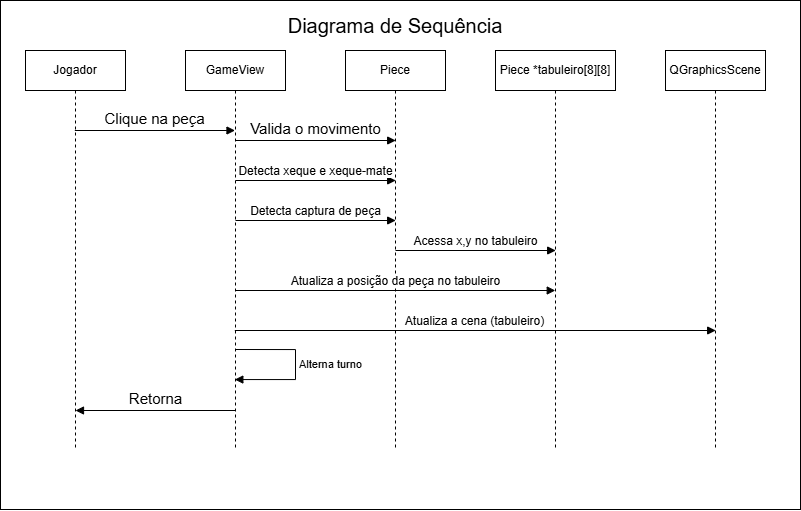

# Projeto orientado a objeto

## Diagrama de Classes - UML

<figure>
  
</figure>

---

## Diagrama de Sequência

##### Cenário: Um jogador seleciona e move uma peça
  - O jogador clica em uma peça no tabuleiro.
  - O sistema verifica se a peça pertence ao jogador do turno atual.
  - O jogador clica na posição desejada.
  - O sistema verifica se o movimento é válido.
  - Se for válido:
    - Atualiza a posição da peça.
    - Verifica se o movimento causa Xeque ou Xeque-Mate.
    - Atualiza o turno para o próximo jogador.
  - Se o movimento não for válido, exibe uma mensagem de erro e não realiza o movimento.

<figure>
  
</figure>

---

[Retroceder](analise.md) | [Avançar](implementacao.md)

